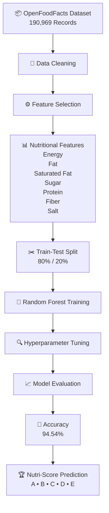

<div align="center">

# NutriInsightX

### AI-Powered Food Label Analysis & Nutrition Intelligence System


<br>


</div>

---

## Overview

NutriInsightX is an AI-powered food label analysis platform that combines Optical Character Recognition (OCR), Machine Learning, and nutritional risk assessment to help users understand packaged food products.

The system extracts ingredient information from food labels, detects allergens and additives, evaluates health risks, and predicts Nutri-Score grades using a Random Forest classifier trained on the OpenFoodFacts Kaggle dataset.

---

## Key Achievements

<table>
<tr>
<td align="center" width="25%">

### 190,969

Training Samples

</td>

<td align="center" width="25%">

### 94.54%

Model Accuracy

</td>

<td align="center" width="25%">

### 7

Nutritional Features

</td>

<td align="center" width="25%">

### A-E

Nutri-Score Classes

</td>
</tr>
</table>

---

## Machine Learning Pipeline


---

## Dataset

### Source

OpenFoodFacts (Kaggle)

### Records Used

190,969 Food Products

### Target Variable

```text
nutrition_grade_fr
```

### Features

```text
energy_100g
fat_100g
saturated-fat_100g
sugars_100g
proteins_100g
fiber_100g
salt_100g
```

---

## Model Performance

| Metric | Value |
|----------|----------|
| Dataset | OpenFoodFacts |
| Records | 190,969 |
| Algorithm | Random Forest |
| Accuracy | 94.54% |
| Target | nutrition_grade_fr |
| Classes | A, B, C, D, E |

### Classification Performance

| Grade | Precision | Recall | F1-Score |
|---------|---------|---------|---------|
| A | 0.97 | 0.95 | 0.96 |
| B | 0.90 | 0.91 | 0.91 |
| C | 0.93 | 0.94 | 0.94 |
| D | 0.96 | 0.96 | 0.96 |
| E | 0.97 | 0.94 | 0.96 |

---

## Features

<table>
<tr>
<td width="50%">

### OCR Food Label Analysis

- Image Upload
- Ingredient Extraction
- Food Label Processing
- Real Package Recognition

</td>

<td width="50%">

### Nutri-Score Prediction

- Random Forest Classifier
- Grade Prediction A-E
- Nutritional Feature Analysis
- ML-Based Classification

</td>
</tr>

<tr>
<td width="50%">

### Allergen Detection

- Milk
- Soy
- Wheat
- Gluten
- Peanuts
- Tree Nuts

</td>

<td width="50%">

### Health Risk Analysis

- Sugar Assessment
- Salt Assessment
- Saturated Fat Analysis
- Energy Evaluation

</td>
</tr>

<tr>
<td width="50%">

### Additive Detection

- Food Additives
- Preservatives
- Ingredient Screening
- Risk Awareness

</td>

<td width="50%">

### Personalized Recommendations

- Consumer Guidance
- Allergy Warnings
- Risk Insights
- Nutritional Suggestions

</td>
</tr>
</table>

---

## System Architecture

```text
Food Package Image
        │
        ▼
     EasyOCR
        │
        ▼
 Ingredient Extraction
        │
 ┌──────┼────────┐
 ▼      ▼        ▼
Language Allergens Additives
Detect   Detect    Detect
        │
        ▼
 Health Risk Engine
        │
        ▼
 Random Forest Model
        │
        ▼
 Nutri-Score Prediction
        │
        ▼
 Recommendations
```

---

## Technology Stack

| Layer | Technologies |
|---------|---------|
| User Interface | Streamlit |
| Computer Vision | EasyOCR, OpenCV, Pillow |
| Machine Learning | Scikit-Learn, Random Forest |
| Data Processing | Pandas, NumPy |
| Language Detection | LangDetect |
| Visualization | Streamlit Charts, Matplotlib |
| Dataset | OpenFoodFacts (Kaggle) |
| Programming Language | Python 3.11 |

---

## Application Preview

### Light Theme

<p align="center">
  
</p>

---

### Dark Theme

<p align="center">
  
</p>

---

### OCR Extraction

<p align="center">
  
</p>

---

### Health Risk Analysis

<p align="center">
  
</p>

---

### Nutri-Score Prediction

<p align="center">
  
</p>

---

## Project Structure

```text
NutriInsightX
│
├── app.py
├── preprocess.py
├── train_model.py
│
├── src
│   ├── ocr_engine.py
│   ├── allergen_detector.py
│   ├── additive_detector.py
│   ├── health_risk.py
│   ├── language_detector.py
│   ├── recommender.py
│   └── nutriscore_predictor.py
│
├── knowledge_base
│   ├── allergens.json
│   └── food_additives.json
│
├── screenshots
│
├── dataset
│
└── models
```

---

## Installation

```bash
git clone https://github.com/LovelySharma-dev/NutriInsightX.git

cd NutriInsightX

pip install -r requirements.txt

streamlit run app.py
```

---

## Future Enhancements

- SHAP Explainability Integration
- Barcode Scanner Support
- Real-Time Camera OCR
- Automated Nutrition Extraction
- Product Comparison Engine
- Mobile Application

---

## License

This project is licensed under the MIT License.

See the LICENSE file for details.

---

## Final Year Report


**AI-Powered Food Label Analysis Using OCR and Machine Learning**