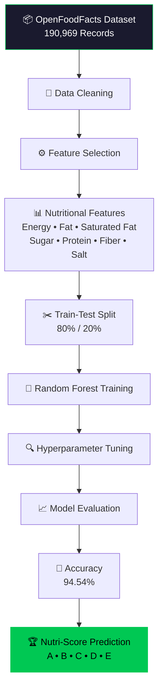
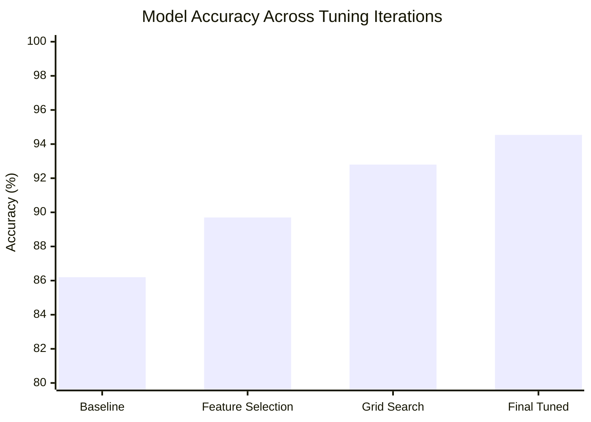
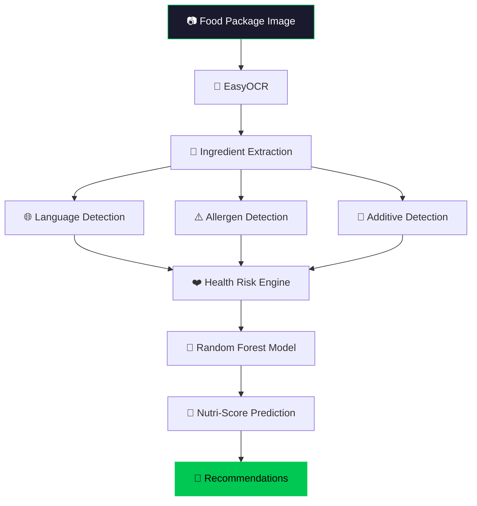

<div align="center">


<!-- 🥗 NutriInsightX -->


### AI-Powered Food Label Analysis & Nutrition Intelligence System


<br>


<br>


<br>

<a href="#-installation">
  
</a>
<a href="#-application-preview">
  
</a>
<a href="#-model-performance">
  
</a>
<a href="#-future-enhancements">
  
</a>

</div>

<br>

<div align="center">

</div>

---

## 📖 Table of Contents

<details open>
<summary>Click to expand</summary>

- [Overview](#-overview)
- [Key Achievements](#-key-achievements)
- [Machine Learning Pipeline](#-machine-learning-pipeline)
- [Dataset](#-dataset)
- [Model Performance](#-model-performance)
- [Features](#-features)
- [System Architecture](#-system-architecture)
- [Technology Stack](#-technology-stack)
- [Application Preview](#-application-preview)
- [Project Structure](#-project-structure)
- [Installation](#-installation)
- [Future Enhancements](#-future-enhancements)
- [License](#-license)

</details>

---

## 🎯 Overview

**NutriInsightX** is an AI-powered food label analysis platform that combines **Optical Character Recognition (OCR)**, **Machine Learning**, and **nutritional risk assessment** to help users understand packaged food products at a glance.

The system extracts ingredient information from food labels, detects allergens and additives, evaluates health risks, and predicts Nutri-Score grades using a Random Forest classifier trained on the OpenFoodFacts Kaggle dataset — all wrapped in a clean, animated, dual-theme (light/dark) Streamlit interface.

> 💡 **Snap a label → Get instant nutrition intelligence.**

---

## 🏆 Key Achievements

<div align="center">

<table>
<tr>
<td align="center" width="25%">

### 🗂️ 190,969
**Training Samples**

</td>

<td align="center" width="25%">

### 🎯 94.54%
**Model Accuracy**

</td>

<td align="center" width="25%">

### 📊 7
**Nutritional Features**

</td>

<td align="center" width="25%">

### 🔠 A–E
**Nutri-Score Classes**

</td>
</tr>
</table>

</div>

<div align="center">


---

## ⚙️ Machine Learning Pipeline



---

## 📂 Dataset

<table>
<tr>
<td width="50%">

**Source:** OpenFoodFacts (Kaggle)
**Records Used:** 190,969 Food Products
**Target Variable:**
```text
nutrition_grade_fr
```

</td>
<td width="50%">

**Features:**
```text
energy_100g
fat_100g
saturated-fat_100g
sugars_100g
proteins_100g
fiber_100g
salt_100g
```

</td>
</tr>
</table>

---

## 📊 Model Performance

<div align="center">

| Metric | Value |
|:--|:--|
| Dataset | OpenFoodFacts |
| Records | 190,969 |
| Algorithm | Random Forest |
| **Accuracy** | **94.54%** |
| Target | `nutrition_grade_fr` |
| Classes | A, B, C, D, E |

### Classification Performance

| Grade | Precision | Recall | F1-Score |
|:--:|:--:|:--:|:--:|
| 🟢 A | 0.97 | 0.95 | 0.96 |
| 🟢 B | 0.90 | 0.91 | 0.91 |
| 🟡 C | 0.93 | 0.94 | 0.94 |
| 🟠 D | 0.96 | 0.96 | 0.96 |
| 🔴 E | 0.97 | 0.94 | 0.96 |

</div>


<summary>📉 View accuracy trend across tuning iterations </summary>




---

## ✨ Features

<table>
<tr>
<td width="50%" valign="top">

### 🔍 OCR Food Label Analysis
- Image Upload
- Ingredient Extraction
- Food Label Processing
- Real Package Recognition

</td>

<td width="50%" valign="top">

### 🏅 Nutri-Score Prediction
- Random Forest Classifier
- Grade Prediction A–E
- Nutritional Feature Analysis
- ML-Based Classification

</td>
</tr>

<tr>
<td width="50%" valign="top">

### ⚠️ Allergen Detection
- Milk
- Soy
- Wheat / Gluten
- Peanuts
- Tree Nuts

</td>

<td width="50%" valign="top">

### ❤️ Health Risk Analysis
- Sugar Assessment
- Salt Assessment
- Saturated Fat Analysis
- Energy Evaluation

</td>
</tr>

<tr>
<td width="50%" valign="top">

### 🧪 Additive Detection
- Food Additives
- Preservatives
- Ingredient Screening
- Risk Awareness

</td>

<td width="50%" valign="top">

### 🎁 Personalized Recommendations
- Consumer Guidance
- Allergy Warnings
- Risk Insights
- Nutritional Suggestions

</td>
</tr>
</table>

---

## 🏗️ System Architecture



---

## 🛠️ Technology Stack

<div align="center">


</div>

| Layer | Technologies |
|:--|:--|
| User Interface | Streamlit |
| Computer Vision | EasyOCR, OpenCV, Pillow |
| Machine Learning | Scikit-Learn, Random Forest |
| Data Processing | Pandas, NumPy |
| Language Detection | LangDetect |
| Visualization | Streamlit Charts, Matplotlib |
| Dataset | OpenFoodFacts (Kaggle) |
| Programming Language | Python 3.11 |

---

## 📸 Application Preview

<div align="center">

**Toggle between themes to see NutriInsightX adapt in real time ☀️ / 🌙**

</div>

### ☀️ Light Theme

<table>
<tr>
<td align="center" width="33%">
<br>
<sub><b>Dashboard — Home Overview</b></sub>
</td>
<td align="center" width="33%">
<br>
<sub><b>Dashboard — Upload Panel</b></sub>
</td>
<td align="center" width="33%">
<br>
<sub><b>Run — OCR Processing</b></sub>
</td>
</tr>
<tr>
<td align="center" width="33%">
<br>
<sub><b>Run — Live Analysis</b></sub>
</td>
<td align="center" width="33%">
<br>
<sub><b>Output — Nutri-Score Result</b></sub>
</td>
<td align="center" width="33%">
<br>
<sub><b>Output — Risk & Allergen Report</b></sub>
</td>
</tr>
</table>

---

### 🌙 Dark Theme

<table>
<tr>
<td align="center" width="33%">
<br>
<sub><b>Dashboard — Home Overview</b></sub>
</td>
<td align="center" width="33%">
<br>
<sub><b>Dashboard — Upload Panel</b></sub>
</td>
<td align="center" width="33%">
<br>
<sub><b>Run — OCR Processing</b></sub>
</td>
</tr>
<tr>
<td align="center" width="33%">
<br>
<sub><b>Run — Live Analysis</b></sub>
</td>
<td align="center" width="33%">
<br>
<sub><b>Output — Nutri-Score Result</b></sub>
</td>
<td align="center" width="33%">
<br>
<sub><b>Output — Risk & Allergen Report</b></sub>
</td>
</tr>
</table>

<details>
<summary>🗂️ Full screenshot file checklist (12 total — click to expand)</summary>

**Light Mode (6)**
- `screenshots/light_dashboard_1.png` — Home overview
- `screenshots/light_dashboard_2.png` — Upload panel
- `screenshots/light_run_1.png` — OCR processing in progress
- `screenshots/light_run_2.png` — Live analysis / spinner state
- `screenshots/light_output_1.png` — Nutri-Score result card
- `screenshots/light_output_2.png` — Risk & allergen report

**Dark Mode (6)**
- `screenshots/dark_dashboard_1.png` — Home overview
- `screenshots/dark_dashboard_2.png` — Upload panel
- `screenshots/dark_run_1.png` — OCR processing in progress
- `screenshots/dark_run_2.png` — Live analysis / spinner state
- `screenshots/dark_output_1.png` — Nutri-Score result card
- `screenshots/dark_output_2.png` — Risk & allergen report

> Drop your captured images into the `screenshots/` folder using these exact filenames and they'll render automatically above.

</details>

---

## 📁 Project Structure

```text
NutriInsightX
│
├── app.py
├── preprocess.py
├── train_model.py
│
├── src
│   ├── ocr_engine.py
│   ├── allergen_detector.py
│   ├── additive_detector.py
│   ├── health_risk.py
│   ├── language_detector.py
│   ├── recommender.py
│   └── nutriscore_predictor.py
│
├── knowledge_base
│   ├── allergens.json
│   └── food_additives.json
│
├── screenshots
│   ├── light_dashboard_1.png
│   ├── light_dashboard_2.png
│   ├── light_run_1.png
│   ├── light_run_2.png
│   ├── light_output_1.png
│   ├── light_output_2.png
│   ├── dark_dashboard_1.png
│   ├── dark_dashboard_2.png
│   ├── dark_run_1.png
│   ├── dark_run_2.png
│   ├── dark_output_1.png
│   └── dark_output_2.png
│
├── dataset
│
└── models
```

---

## 🚀 Installation

```bash
# 1. Clone the repository
git clone https://github.com/LovelySharma-dev/NutriInsightX.git

# 2. Move into the project directory
cd NutriInsightX

# 3. Install dependencies
pip install -r requirements.txt

# 4. Launch the app
streamlit run app.py
```

<div align="center">

Then open your browser at **`http://localhost:8501`** 🎉

</div>

---

## 🔮 Future Enhancements

- [ ] SHAP Explainability Integration
- [ ] Barcode Scanner Support
- [ ] Real-Time Camera OCR
- [ ] Automated Nutrition Extraction
- [ ] Product Comparison Engine
- [ ] Mobile Application

---

## 📄 License

This project is licensed under the **MIT License**.
See the [LICENSE](LICENSE) file for details.

---

## 🎓 Final Year Report

**AI-Powered Food Label Analysis Using OCR and Machine Learning**

---

<div align="center">

### ⭐ If you found this project useful, consider giving it a star!


</div>